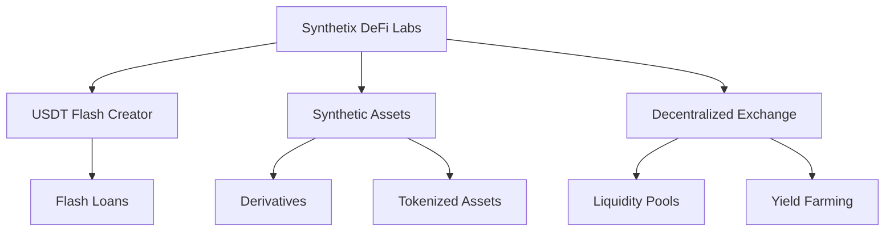
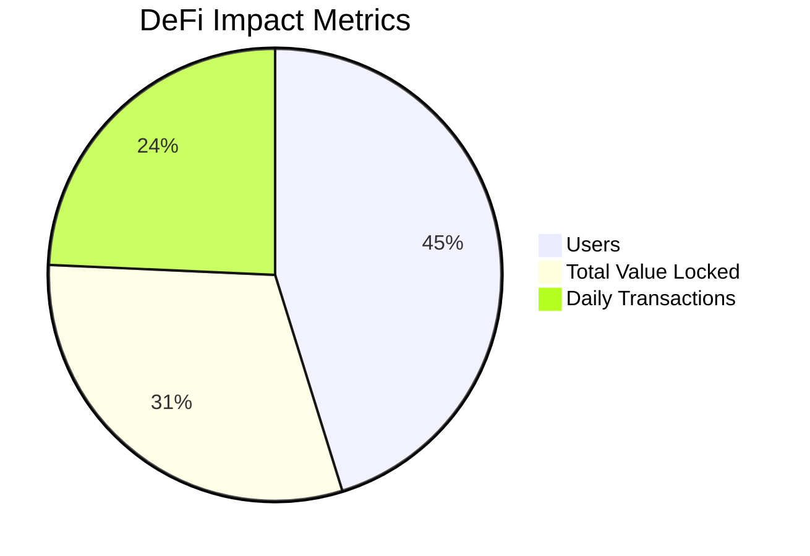

# Welcome to Synthetix DeFi Labs 🚀


## Revolutionizing DeFi, One Block at a Time 💎

Synthetix DeFi Labs is your gateway to the future of decentralized finance. We're not just participating in the DeFi revolution - we're leading it.

### 🌟 Our Ecosystem



### 🚀 Project Structure

```
Synthetix DeFi Labs
├── USDT-Flash-Creator
│   ├── Core Engine
│   └── Web Interface
├── Synthetic Assets Platform
│   ├── Asset Tokenization
│   ├── Derivatives
│   └── Oracle Integration
└── Decentralized Exchange
    ├── Trading Engine
    ├── Liquidity Pools
    └── Yield Farming Protocols
```

### 💼 Our Solutions

| Solution | Description | Status |
|----------|-------------|--------|
| USDT Flash Creator | Innovative tool for USDT operations | 🟢 Active |
| Synthetic Assets | Platform for creating and trading synthetic assets | 🟡 Beta |
| Decentralized Exchange | High-performance DEX with advanced features | 🔵 In Development |
| DeFi Education Hub | Resources for learning about DeFi | 🟢 Active |

## 🛠️ Technologies We Love

- Solidity & Web3.js for smart contracts
- React & Node.js for web applications
- Python for data analysis and backend services
- IPFS for decentralized storage

## 🌐 Connect with Us

- [Website](http://synthetixcrypto.com)
- [Telegram](https://t.me/SynthetixLabs)
- [Email](mailto:support@synthetixcrypto.com)

## 🤝 Join the Revolution

We're always looking for brilliant minds to join our mission. Check out our repositories and don't hesitate to contribute!

### How to Contribute

1. Fork the repository of interest
2. Create your feature branch (`git checkout -b feature/AmazingFeature`)
3. Commit your changes (`git commit -m 'Add some AmazingFeature'`)
4. Push to the branch (`git push origin feature/AmazingFeature`)
5. Open a Pull Request

## 📊 Our Impact



---

**Synthetix DeFi Labs: Learn, Grow, and Earn in the Decentralized World** 🌍

*Made with 💖 in Türkiye*
