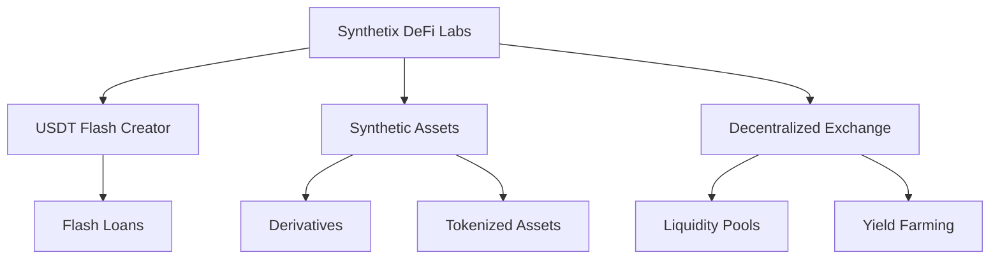
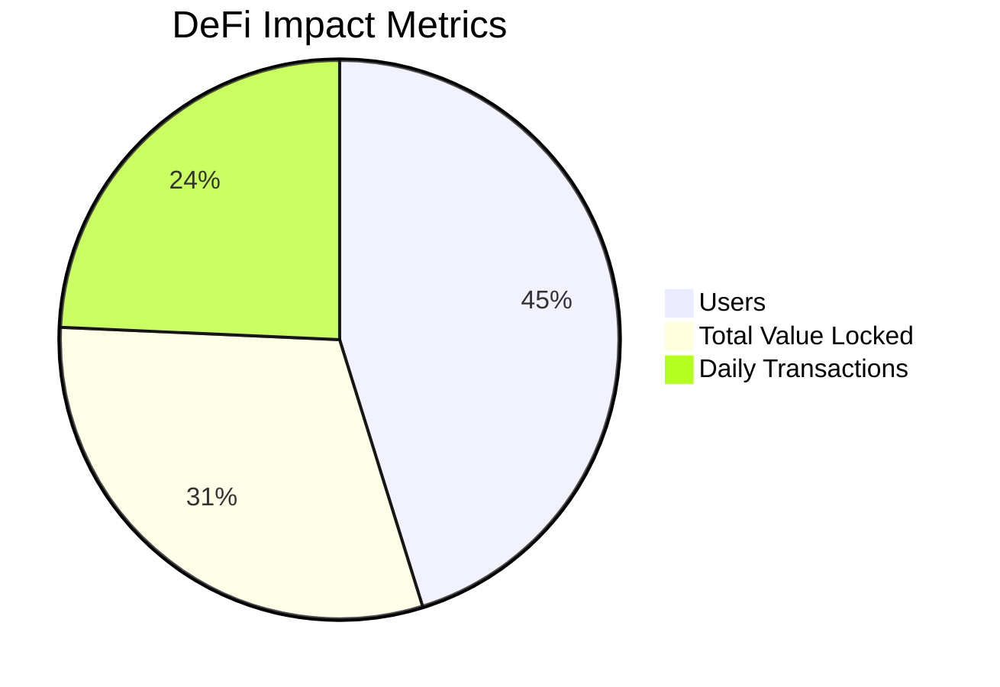

<div align="center">

# Synthetix DeFi Labs


**Revolutionizing DeFi, One Block at a Time**

[Website](http://synthetixcrypto.com) | [Telegram](https://t.me/SynthetixLabs) | [Email](mailto:support@synthetixcrypto.com)

</div>

---

## 🌟 About Us

Synthetix DeFi Labs is at the forefront of the decentralized finance revolution. We develop cutting-edge solutions that empower users to learn, grow, and earn in the blockchain ecosystem.

---

## 🚀 Our Ecosystem

<div align="center">



</div>

---

## 💼 Our Solutions

| Solution | Description | Status |
|:--------:|-------------|:------:|
| USDT Flash Creator | Innovative tool for USDT operations | 🟢 Active |
| Synthetic Assets | Platform for creating and trading synthetic assets | 🟡 Beta |
| Decentralized Exchange | High-performance DEX with advanced features | 🔵 In Development |
| DeFi Education Hub | Resources for learning about DeFi | 🟢 Active |

---

## 🛠️ Technology Stack

- **Smart Contracts:** Solidity, Web3.js
- **Frontend:** React
- **Backend:** Node.js, Python
- **Storage:** IPFS

---

## 🌐 Project Structure

```
Synthetix DeFi Labs
├── USDT-Flash-Creator
│   ├── Core Engine
│   └── Web Interface
├── Synthetic Assets Platform
│   ├── Asset Tokenization
│   ├── Derivatives
│   └── Oracle Integration
└── Decentralized Exchange
    ├── Trading Engine
    ├── Liquidity Pools
    └── Yield Farming Protocols
```

---

## 🤝 Contributing

We welcome contributions from the community! Here's how you can get involved:

1. Fork the repository of interest
2. Create your feature branch (`git checkout -b feature/AmazingFeature`)
3. Commit your changes (`git commit -m 'Add some AmazingFeature'`)
4. Push to the branch (`git push origin feature/AmazingFeature`)
5. Open a Pull Request

---

## 📊 Our Impact

<div align="center">



</div>

---

<div align="center">

**Synthetix DeFi Labs: Learn, Grow, and Earn in the Decentralized World**

*Made with 💖 in Türkiye*

</div>
